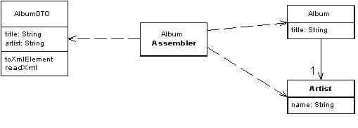

***********
API
***********

Maintainability
---------------
Wartbarkeit ist die Eigenschaft leicht verändert werden zu können.
Man will zum Beispiel etwas korrigieren oder verbessern, an eine neue
Komponente oder an ein System anpassen.

Remote APIs unterscheiden sich von lokalen APIs in der Wartbarkeit.

API Requirements
----------------

* Low latency
* High throughput
* Robustness
* Error handling
* Multi tenancy (dt. Mandantenfähigkeit) and API security
* User session stickiness and data privacy
* Extensibility and flexibility (a.k.a. evolvability)
* Backward compatibility

Service Design Patterns
-----------------------

Service Layer Pattern
^^^^^^^^^^^^^^^^^^^^^

Die Komplexität eines Systems muss nach aussenhin verborgen sein. Man möchte keine
primitiven Operationen und komplexe Modelle bereitstellen, stattdessen
sollte eine ausgewählte Menge Operationen, die alle wichtigen Handlungen umfassen.

    If in doubt, leave it out!

Remote Facade
^^^^^^^^^^^^^

.. image:: images/remote-facade.gif

Data Transfer Object (DTO)
^^^^^^^^^^^^^^^^^^^^^^^^^^

POINT-Test
----------
**An API should get (and stick) to its POINT**
P
    an API must be purposeful (e.g., driven by client demand/use cases)
O
    an API should expose domain objects (e.g., resources or services)
    and adhere to OO principles such as high cohesion/low coupling
I
    each API call should be as isolated as possible
    (i.e., free of side unexpected, undesired effects)
N
    an API should be neutral, i.e. not optimized for any particular client channel
T
    an API should be “t-shaped” (i.e., offer broad and deep calls), e.g.,
    provide a master-detail interface and/or search functionality

