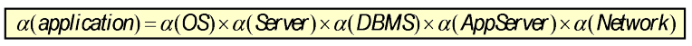

Availability
============

Definition
----------
Ein System gilt als **verfügbar** wenn es läuft und korrekte Resultate produziert.
**Hohe Verfügbarkeit** ist, wenn die Verfügbarkeit nahe bei 100% ist.

Wir können also folgende Schlussfolgerungen ziehen:

* Je mehr Fehler ein System hat, desto weniger ist es verfübar
* Je länger es dauert um eine System zu reparieren, desto weniger ist es verfügbar

**Verfügbarkeit = MTBF / (MTBF + MTTR)**

Mean Time Between Failure (MTBF)
^^^^^^^^^^^^^^^^^^^^^^^^^^^^^^^^
Die Durchschnittszeit bevor ein System fehlschlägt.
MTBF misst also die Zuverlässigkeit.

Mean Time To Repair (MTTR)
^^^^^^^^^^^^^^^^^^^^^^^^^^
Die Durchschnittszeit um ein System zu reparieren.
Entspricht der Downtime.

Possible Downtime per %
-----------------------

==============  =================
Availability %  Downtime per year 
==============  =================
90%             36.5 days
95%             18.25 days
98%             7.3 days
99%             3.65 days
99.5            1.83 days
99.9            8.76 hours
99.99           52.56 minutes
99.999          5.26 minutes
==============  =================

Optimale Verfübarkeit
---------------------

Tactics
-------

* Select fault-tolerant hardware
* Use high-availability clustering and load balancing
* Log transactions
* Apply software availability solutions
* Select or create fault-tolerant software
* Design for failure
* Allow for component replication
* Relax transactional consistency
* Identify backup and disaster recovery solutions

Verfügbarkeit bei verteilten System
-----------------------------------
Wenn mehrere Systeme voneinander abhängen, ist die gesamte Verfügbarkeit das Produkt
der Verfübarkeit der Systeme.

Bei der Verfügbarkeit ist also das schwächste Glied der Kette wichtig.

Redundanz
=========

===========  ===============  =============  ============
Modus        Installed Nodes  Running Nodes  Active Nodes
===========  ===============  =============  ============
Single Node  1                1              1
Cold Standby N                1              1
Warm Standby N                N              1 
Hot Standby  N                N              N
===========  ===============  =============  ============

Cold Standby
------------
A cold server is a backup server whose purpose is solely to be there in case
the main server is lost. The cold server is basically turned on once to have
software installed and configured, and then is turned off until needed.

Warm Standby
------------
A warm server is a backup server that is turned on periodically to receive updates
from the server being backed up. Warm servers are often used for
replication and mirroring.

Hot Standby
-----------
A hot server is a backup server that receives regular updates and
is standing by ready (on hot standby) to take over immediately in
the event of a failover.

Single Point of Failure (SPOF)
------------------------------
Potentielle SPOFs:

Active Directory Server 
    Schlägt die Authentisierung / Autorisierung fehl läuft meistens gar nichts mehr
Externe Komponenten
    Zum Beispiel der Shipping Scheduler der nicht so oft gebraucht wird und deshalb
    nicht redundant ausgelegt ist
Garbage Collector
    Läuft der GC nicht mehr, wird das Programm irgendwann abstürzen.

