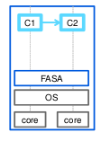
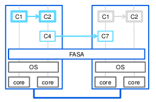
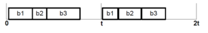

***************************
Distributed Control Systems
***************************

Definition
==========
A real-time system is one that must process information and produce a response within a specified time, else risk severe consequences, including failure. That is, in a system with a real-time constraint it is no good to have the correct action or the correct answer after a certain deadline: it is either by the deadline or it is useless!

**System must react to stimulus within given deadlines**

* Determinism vs. performance
* Worst-case vs. average-case execution time (Car airbag (60-80 milliseconds)

Future Automation System Architecture (FASA)
============================================

* Is a real-time middleware
* Is based on components
* Provides platform abstraction
* Is a deterministic, linear execution framework
* Supports any number of CPU and cores

More Details
------------

* Separates components in memory
* Spans across cores and systems
* Provides distributed execution
* Enables software-based fault tolerance
* Allows for dynamic software updates

Distributed Scheduling
======================

Accommodating concurrent tasks on the available
resources.

* Static schedule
* Based on Worst-Case Execution Time (WCET)
* Tasks are scheduled in a fixed order

Fault Tolerance
===============
TODO

