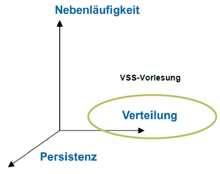
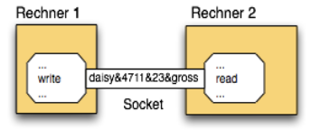
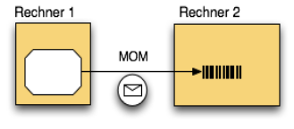
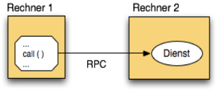
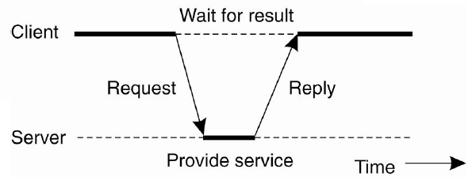

**********
Grundlagen
**********

Prüfungsrelevante Themen:

* VSS-Definitionen
* Middleware-Begriff
* Architekturstile
* einfache Web-Programmierung und Java-Netzwerkklassen

Definitionen
============

Programm
--------
* Hat einen Anfang und ein Ende
* Akzeptiert Input und produziert Output
* Läuft deterministisch
* Ist clock-driven

System
------
Besteht aus Programmen und Subsystemen

* Hört evtl. nie auf
* Azeptiert immer Input
* Oft dynamisch konfiguriert
* Kann sich nichtdeterministisch verhalten
* Ist event-driven

Distributed System
------------------
A distributed system is a collection of independent computers that
appears to its users as a single coherent system.

Transparency
------------

============   ===========
Transparency   Description
============   ===========
Access         Hide differences in data representation and how a resource is accessed
Location       Hide where the resource is located
Migration      Hide that the resource may move to another location
Relocation     Hide that the resource may be moved to another location while in use
Replication    Hide that resources is replicated
Concurrency    Hide that resource may be shared
Failure        Hide failure and recovery
============   ===========

Dimensionen
-----------
Verteilte Software Systeme besitzen drei unabhängige Merkmale:

* Nebenläufigkeit
* **Verteilung**
* Persistenz

Message Passing Interface (MPI)
-------------------------------
Eine Alternative zu Sockets speziell für die Kommunikation
im High Performance Computing (HPC) Bereich.

Message Exchange Pattern (MEP)
------------------------------
Ein Template das die Verbindungsart für den Austausch von Nachrichten
festlegt. Beispiele sind:

* Datagram
* Request-Response
* Duplex

Diese können auch alle noch Connection-Oriented sein in dem man eine Session
hält.

Abstraktionsebene der Verteilung
--------------------------------

Datenaustausch
^^^^^^^^^^^^^^
* Sockets (UDP/TCP über IP)
* File Transfer
* Shared Database

Nachrichtenaustauch
^^^^^^^^^^^^^^^^^^^
* Message-Oriented Middleware
* HTTP GET, POST

Remote Procedure Call (RPC)
^^^^^^^^^^^^^^^^^^^^^^^^^^
* DCE RPC
* Java RMI, CORBA
* Web Services, RESTful HTTP

Middleware
==========

    Middleware ist infrastrukturelle Software zur Kommunikation zwischen
    Software-Komponenten und Anwendungen auf verschiedenen Computern

Die Middleware erfüllt folgende Funktionen:

* Dient als Verteilungsplatform die viele Protokolle unterstützt
* Bietet höheres Abstraktionsniveau
* Verbirgt Komplexität darunter

Gründe für eine Einführung:

* Interoperabilität
* Vereinfachung

Communication-oriented middleware
---------------------------------
Stellt ein von der Applikation unabhängiges Protokoll zur Verfügung.

* Low-level protocols and API (infrastructure)
* Sockets

Anwendungsorientierte Middleware
--------------------------------
Benutzt ein spezifisches Protokoll

* High-level protocols and API (programming models)
* CORBA IDL, RMI interfaces
* WSDL/SOAP Webservices

Multi Channel Architecture (MCA)
--------------------------------

Architekturstile
================

Distributed Objects
-------------------
Jedes Objekt ist unabhängig vom Ort und antwortet auf einen Method Call.

N-Layers
--------
Jedes Layer kennt nur das tieferliegende Layer. Ein Request geht durch alle Layers
hindurch (Request flow) und wieder zurück (Response flow).

Client-Server
-------------
Der Client sendet einen Request auf den Server und bekommt die Antwort.

2-Tier Architecture
-------------------
Die Applikationsschichten lassen sich beliebig auf den Server oder Client auslagern.
Sowohl Persistenz und die eigentliche Business Logik wird vom Server bereitgestelllt, der Client ist lediglich ein Thin Client.
Das lässt sich in der Praxis nicht immer so leicht trennen, deshalb gibt es verschiedenste
Variationen.

3-Tier Architecture
-------------------
Tier 1  : Clients mit Browser
Tier 2: Web Server und Presentation Logic (z.B. HTML Templates)
Application Server und Business Logic
Tier 3: Database

Event Driven Architecture
-------------------------
Reagiert auf Ereignisse.

Peer-to-Peer Systeme
--------------------

Eight Fallacies of Distributed Systems
--------------------------------------

.. NOTE:: Nicht prüfungsrelevant

The network is reliable
^^^^^^^^^^^^^^^^^^^^^^^
Oft ist mit Netzwerk das Internet gemeint.
Wenn ein Zugriff auf eine 3rd Party API gemacht wird, ist die Chance gross,
dass dieser Service auch offline gehen kann.

Latency is zero
^^^^^^^^^^^^^^^
Server näher zu den Kunden bringen (mit Cloud Availability Zones und CDNs).

Bandwidth is infinite
^^^^^^^^^^^^^^^^^^^^^
Die meisten Mobilgeräte haben keine unlimitierte Bandbreite.

The network is secure
^^^^^^^^^^^^^^^^^^^^^
TLS

Topology doesn’t change
^^^^^^^^^^^^^^^^^^^^^^^

There is one administrator
^^^^^^^^^^^^^^^^^^^^^^^^^^
Even with applications hosted in your own private datacenter, your applications are likely interacting with systems outside your administrative control.

Transport cost is zero
^^^^^^^^^^^^^^^^^^^^^^
Not only is transport cost not zero, it’s priced.

