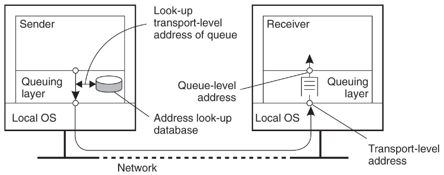
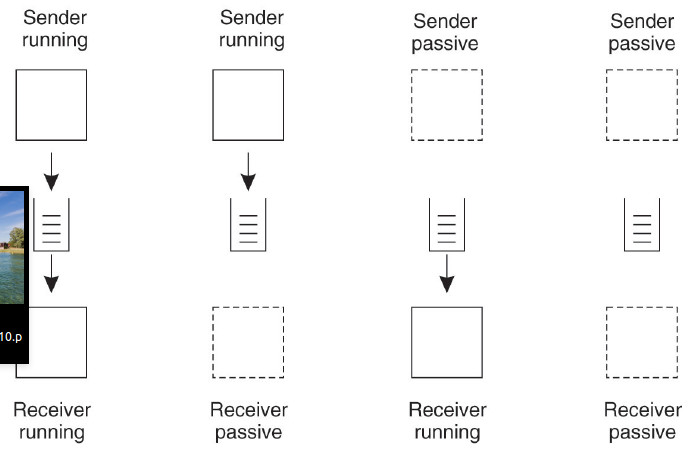
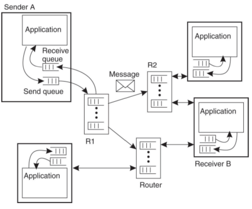
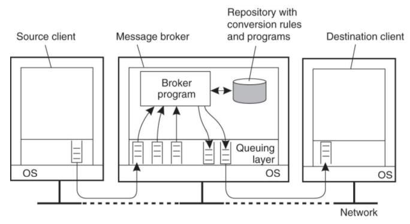
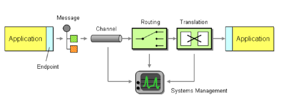
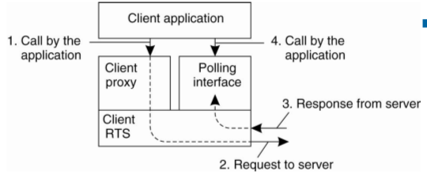
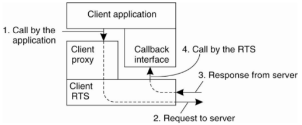

*********
Messaging
*********

Queue-basiertes Messaging gestattet die flexible und lose Kopplung
unterschiedlichster Systeme:

* Auf unterschiedlichen Plattformen
* In unterschiedlichen Programmiersprachen
* Mit völlig unterschiedlichen Message-Formaten (Text, Byte, Objekt).

Messaging wird heute vielfach als einfacherer Ansatz für die Integration
unterschiedlicher Systeme eingesetzt mit den Merkmalen:

* Einfachheit
* Lose Kopplung
* Erweiterbarkeit
* Skalierbarkeit
* Fehlertoleranz

Die APIs sind einfach zu benutzen, es müssen aber viele
Designentscheidungen getroffen werden:

* Message intent (command vs. data)
* Returning a response (request-reply)
* Huge amounts of data (sequencing)
* Slow messages (message expiration)
* QoS (guaranteed delivery, transactionality, idempotency)

Message Oriented Middleware (MOM)
=================================

Message Queing Model
--------------------

Mit dem Message-Queuing Model enkoppelt man den Empfänger von der Zeitdimension.
Er kann selbst wählen, wie er die Nachricht empfangen will.

Der Sender kann auch eine lokale Queue verwenden um beispielsweise momentane
Übertragungsprobleme auszugleichen oder inkommende Nachrichten zu puffern.

Architekturen
-------------

Pipes-and-Filter Chaining
^^^^^^^^^^^^^^^^^^^^^^^^^

Hub-and-Spoke Architecture
^^^^^^^^^^^^^^^^^^^^^^^^^^

API Primitives
--------------

=========  ========   ================
Primitive  Blocking   Meaning
=========  ========   ================
PUT        Nein       Nachricht an eine Queue anhängen. 
GET        Ja         Warten bis eine Queue nicht leer ist und erste Message entfernen.
POLL       Nein       Erste Message entfernen wenn die Queue nicht leer ist.
NOTIFY     Nein       Handler wird aufgerufen wenn eine neue Message in der Queue ist.

Java Messaging Service (JMS)
============================
JMS eine Message Oriented Middleware (MOM) API um Nachrichten auszutauschen.
Java EE bring von Haus aus eine JMS Implementation mit.
Externe **JMS Provider** implementieren lediglich
das JMS Interface.

Einige Provider Implementationen:
* Apache ActiveMQ
* Redis
* JBoss
* RabbitMQ
* WebSphere MQ

Terminologie
------------

Client
^^^^^^
An application or process that produces and/or receives messages.

Producer/Publisher
^^^^^^^^^^^^^^^^^^
A JMS client that creates and sends messages.

Consumer/Subscriber
^^^^^^^^^^^^^^^^^^^
A JMS client that receives messages.

Message
^^^^^^^
An object that contains the data being transferred between JMS clients.

Queue
^^^^^
A staging area that contains messages that have been sent and are waiting to be read
(by only one consumer). Note that, contrary to what the name queue suggests,
messages don't have to be delivered in the order sent.
A JMS queue only guarantees that each message is processed only once.

Topic
^^^^^
A distribution mechanism for publishing messages that are delivered
to multiple subscribers.

Channel Types
-------------

Point-to-Point Channel
^^^^^^^^^^^^^^^^^^^^^^
**How can the caller be sure that exactly one receiver will receive the
document or perform the call?**

Messages werden zu einem spezifischen Consumer gerouted, der eine Queue für die
Messages verwaltet. Jede Message geht an eine spezifische Queue.

Publish-Subscribe Channel
^^^^^^^^^^^^^^^^^^^^^^^^^
**How can the sender broadcast an event to all interested receivers?**

Messages werden an ein spezielles Topic gesendet. Subscriber können alle Messages
zu einem Topic abonnieren. Der Publisher muss die Consumer nicht kennen.

Quality of Service (QoS) Settings
---------------------------------

=================  ===========================================
Attribute          Description
=================  ===========================================
Transport Type     Transport Protokoll für die Übertragung
FIFO delivery      Messages werden in der Reihenfolge zugestellt, in der sie gesendet wurden
Message length     Maximale Länge einer Nachricht
Setup retry count  Maximale Anzahl Versuche um die Remote Queue zu erreichen
Delivery retries   Maximale Anzahl Versuche um eine Nachricht in die Queue zu speichern
=================  ===========================================

Persistenz
----------

Nicht-Persistent
^^^^^^^^^^^^^^^^
* Vorteil dieses Modus ist der geringe Overhead.
* Die Nachrichten werden nicht gelogged oder gespeichert.
* Falls ein JMS Provider ausfällt, kann eine solche Meldung verloren gehen.

Persistent
^^^^^^^^^^
* Instruiert den JMS Provider, dass dieser sich darum kümmern muss, dass die
  Nachrichten nicht verloren gehen.
* Der JMS Provider muss solche Nachrichten auch garantiert maximal einmal
  abliefern.
* Eine Nachricht kann also verloren gehen, darf dann aber garantiert nur einmal
  abgeliefert werden.
* Ein JMS Provider muss eine PERSISTENT Message einmal-und-nur-einmal
  abliefern. Dadurch wird die Performance verschlechtert.

Message-Struktur
----------------

Header
^^^^^^
Er enthält Informationen für das Routing und die Identifikation oder auch QoS Settings.
Ein MOM-Provider normiert seine Message Header.

Properties (optional)
^^^^^^^^^^^^^^^^^^^^^
Informationen, mit
deren Hilfe ein Consumer Nachrichten filtern oder weiterrouten kann
(Erweiterungen des Standard-Headers).

Body
^^^^
Enthält die auszutauschenden Nutzdaten (Text, Objekte, Binärdaten).

Ablauf
------

* Create – the sender creates the message and populates it with data.
* Send – the sender adds the message to a channel.
* Deliver – the messaging system moves the message from the sender’s
  computer to the receiver’s computer, making it available to the receiver.
* Receive – the receiver reads the message from the channel.
* Process – the receiver extracts the data from the message.

Enterprise Integration Patterns
===============================

Polling Consumer
----------------
Blocking Receive-Call (optionaler Timeout)

Event-driven Consumer
---------------------
Request Handler Pattern

Guaranteed Delivery Pattern
---------------------------

RabbitMQ
========

TODO

