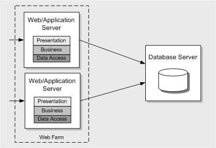

==================================
Non-Functional Requirements (NFRs)
==================================

* Availability
* Compliance
* Maintainability
* Performance
* Response time, latency; throughput
* A.k.a. completion time, service time, ...
* Privacy
* Recovery
* Resilience, Fault Tolerance, Robustness
* Scalability
* Throughput
* Usability, User-Friendliness

Performance NFR
---------------

.. danger:: TODO

Performance and Scalability Tactics
-----------------------------------

* Optimize repeated processing
* Reduce contention via replication
* Prioritize processing
* Consolidate related workload
* Distribute processing over time
* Minimize the use of shared resources
* Reuse resources and results
* Partition and parallelize
* Scale up or scale out
* Degrade gracefully
* Use asynchronous processing
* Relax transactional consistency
* Make design compromises

.. danger:: TODO

Quality Attributes (QAs)
------------------------
* QA Accuracy: orders must not be lost, resource reservations must be undone
* QA Efficiency (performance): sub-second response times specified
* QA Interoperability: multiple platforms to be supported
* QA Modifiability: skills for selected technologies must be available locally

====================
Deployment Diagramme
====================

UML Deployment Diagramm
-----------------------
Hardware, Prozessoren und Runtimes (z.B. JVM) werden als Nodes
dargestellt.

Artefakte werden Nodes zugewiesen um den Deployment Status des Systems
zu modellieren.

.. image:: images/deployment-diagram-overview-manifestation.png

.. image:: images/deployment-diagram-overview-specification.png

UML Komponenten Diagramm
------------------------

========================
MSDN Deployment Patterns
========================

Non-Distributed Deployment
--------------------------

Distributed Deployment
----------------------

Web Farms
---------

Load-balancing Cluster
----------------------

Failover Cluster
----------------

===================
Performance Testing
===================

Gatling
-------
Gatling ist eine Load Testing Software mit der man Benutzungsszenarien spezifizieren
und deren Ausführungszeit messen kann. Um Szenarien zu modellieren eignen sich
UML Aktivitätsdiagramme gut.

In einer realen Testumgebung kann es gut sein, dass von einem einzelnen Load Generator
nicht genügend Usersessions simuliert werden können, um den zu testenden Server voll auszulasten.

UML Aktivitätsdiagramm
----------------------

Akzeptanzkriterien
------------------
Es empfiehlt sich in jedem Fall für eine Applikation Akzeptanzkriterien zu definieren.
Die dabei gewählten Metriken müssen **spezifisch, messbar und realistisch** sein.

Beispiele für Akzeptanzkriterien:

===  ===========================================  ===================
Nr   Kriterium                                    Metrik
===  ===========================================  ===================
K1   Die Webseite soll flüssig bedienbar sein.    Response Time in ms
     95% aller Requests sollen in weniger als
     500ms beantwortet werden.
K2   Das erstellen eines Tweets darf in 95% der   Response Time in ms
     Fälle nicht länger als 2s dauern
K3   99.9% der Requests müssen ohne Fehler        no_errors / no_total
     durch den Server beantwortet werden können.
===  ===========================================  ===================

Kapazitätstest
--------------
Performance sollten an der Kapazitätsgrenze durchgeführt werden.
Deshalb muss zuerst evaluiert werden, wieviele Benutzer ein System zur gleichen
Zeit benutzen können.
Die Kapazitätsgrenze findet man heraus, indem man die Anzahl User hochschraubt,
ohne das man die Akzeptanzkriterien verletzt.

Diese Kapazitätsgrenze kann nun als Baseline für Performance Tests genommen werden.

Performancetest
---------------
Man kann nun versuchen Performancesteigerung durchzuführen und dann nochmals
den Performancetest laufen lässt. Diesen kann man nun mit der Baseline vergleichen.

