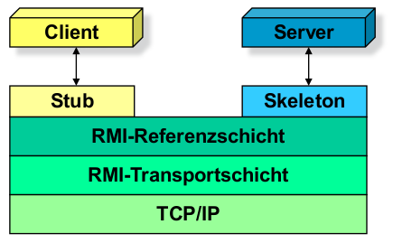
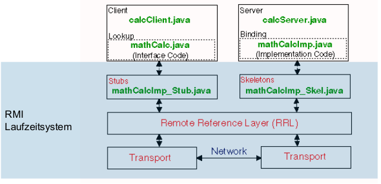
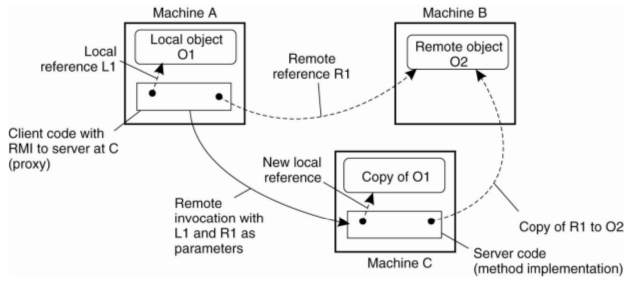
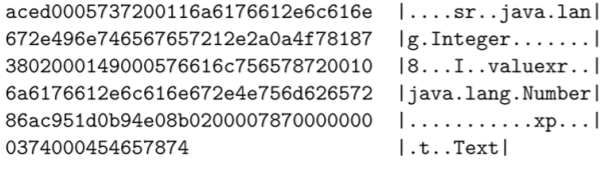

******************************
Remote Method Invocation (RMI)
******************************

IDL
===
IDL-Begriff, IDL-Beispiele, IDL-Prozess

Recurring Design Issues in Remoting:
* Wire protocol
* Naming/addressing of endpoints
* Message Exchange Pattern (MEP) on application level
* Request-Reply, One-Way, Long Polling, ...
* Data formatting (requests, replies) a.k.a. parameter syntax
* QoS policies:

Um diese Probleme in den Griff zu kriegen, wird ein Vertrag/Interface benötigt,
der diese Aspekte definiert.

Service Contract vs. Service Implementation
-------------------------------------------
TODO:

RMI-Architektur
===============

Wird eine Methode auf einem Objekt aufgerufen, wird ein synchroner Aufruf vom Client
an den Server gemacht.
Der Anwendungsentwickler auf der Client-Seite bleibt der Remote Aufruf verborgen
(Proxy Pattern).

RMI-Registry
------------

Remote Objekte können auch referenziert werden, dies muss speziell
über einen Namensdienst (RMI-Registry) gehandhabt werden. Diese RMI-Registry
wird von der RMI-Referenzschicht zur Verfügung gestellt.
RMI stellt ebenfalls einen Mechanismus bereit um ein Remote Object,
dass als Parameter an ein anderes Remote Object übergeben wurde, dynamisch nachzuladen.

RMI-Compiler
------------
All die Stubs und Skeletons von Hand anzulegen wäre eine zu grosse Handarbeit.
Deshalb wird RMI-IDL (als Interface Sprache) benutzt. Mithilfe des RMI-Compiler
kann man dann vom RMI-IDL automatisch Proxies und Stubs erzeugen.

In neuen Java Versionen kann dies auch dynamisch zur Laufzeit mithilfe von Introspection
passieren.

Stub
----
Ein Stub ist ein Stellvertreterobjekt (Remote Proxy), das Clientaufruf an
Server weiterreicht.

Die Stub-Klasse baut Socket-Verbindung zu Server auf (CONNECT).
Sie schickt Namen der Methode und Parameter und holt das Ergebnis ab.

Skeleton
--------
Ein Skeleton nimmt Aufrufe des Stubs entgegen und leitet sie an
Serverobjekt weiter.

Erzeugt Socket auf demselben Port wie Stub (BIND/LISTEN/ACCEPT), wartet auf den
Methoden-aufruf vom client und delegiert diesen an das Objekt. Der Rückgabewert wird
dann über die Socketverbindung an Client zurück gesendet.

Deployment
----------
Die RMI-Registry wurde sowohl vom Client, als auch vom Server verwendet.
Um diese bereitzustellen, wird ein Infrastruktur Server benötigt.

Wer started die RMI-Registry?
^^^^^^^^^^^^^^^^^^^^^^^^^^^^^
Die RMI-Registry muss separat auf dem Infrastruktur Server gestartet und verwaltet
werden.

Kritik
------
* Es ist nicht immer klar, dass es sich um Remote Zugriffe handelt (Timeout Management)
* Client und Server sind stark gekoppelt (Objekt Serialisierung ist starker Vertrag)
* Binäres Protokoll (Kompabilität benötigt, gleiche Java Version auf Client und Server) 
* Referenzen müssen gemanagt werden (Remote Garbage collection)
* Wird oft von der Firewall geblocket, da es sich um ein eigenes Protokoll handelt.

RMI Beispiel
============

Server und Client
^^^^^^^^^^^^^^^^^
Es muss ein Interface für die Remote-Methoden erstellt werden, dass sowohl
dem Client, als auch dem Server bekannt ist

.. code-block:: xml

    import java.rmi.Remote;
    import java.rmi.RemoteException;
    public interface Hello extends Remote {
        String sayHello() throws RemoteException;
    }

Server
^^^^^^
Der Server implementiert nun dieses Interface

.. code-block:: xml

    import java.rmi.RemoteException;
    import java.rmi.server.UnicastRemoteObject;
    public class HelloImpl extends UnicastRemoteObject implements Hello
    {
        public HelloImpl() throws RemoteException {
            super();
        }
        public String sayHello() throws RemoteException {
            return "Hello World!";
        }
    }

Nun muss ein Remote Object der Implementierung erzeugt und bei der RMI-Registry
angemeldet::

    import java.rmi.Naming;
    public class HelloServer {
        public static void main(String args[]) {
            try {
                HelloImpl obj = new HelloImpl();
                Naming.rebind("rmi://[hn]/remoteHello", obj);
            } catch (Exception e) { ... }
        }
    }

Client
^^^^^^

Zuerst muss das Remote Object von der RMI-Registry abgeholt werden.
Danach können wir auf dem Interface alle definierten Methoden aufrufen::

    import java.rmi.*;
    public class RmiClient {
        public static void main(String[] args) {
            try {
                Hello obj =(Hello)Naming.lookup("rmi://[hn]/remoteHello");
                String message = obj.sayHello();
                System.out.println(message);
            } catch (Exception e) { ... }
        }
    }

Call-by-Value
-------------
Es werden Kopien der Objekte zwischen Client und Server verschickt, dazu müssen
die Parameter-Klassen serialisierbar sein.

* Vorteil: sie Anzahl der remote Zugriffe ist reduziert
* Nachteil: Änderungen von entfernten Objekten sind so nicht möglich

Call-by-Reference
-----------------
Referenz auf das Parameter-Objekt wird an den Server übertragen, dazu muss die
Parameter-Klasse ebenfalls ein RMI-Object sein (sie muss also ein Remote-Interface
haben und von `UnicastRemoteObject` ableiten).

* Vorteil: Server kann übergebene Client-Objekte auf Client ändern
* Nachteil: Remote-Zugriffe sind teuer

Objekt Serialisierung
---------------------
Um die Java Objekte zu übertragen, müssen sie zuerst serialisiert werden.
Bei der Serialisierung werden die Objekte in einen flachen, geordneten Bytestream
geschrieben.

Um in Java ein Klasse serialisierbar zu machen, muss das Objekt mit dem Marker Interface
`java.io.Serializable` ausgezeichnet werden::

    public class Person implements Serializable {
        private static final long serialVersionUID = 1L;
        private String name;
        private String place;
        private int year;
        Person(String aName, String aPlace, int aYear) {
            name = aName;
            place = aPlace;
            year = aYear;
        }
    }

Die `serialVersionUID` ist die Versionsnummer einer Klasse.
Wird ein Objekt deserialisiert, werden die `serialVersionUID` des Codes und
des Objekts verglichen. Stimmen diese nicht überein
wird eine `InvalidClassException` auftreten.
