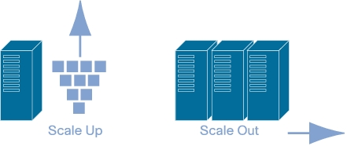

Scalability
-----------
Scalability ist die Fähigkeit:

* mit steigender Belastung umzugehen
* ohne die SLAs zu verletzen
* indem die Anzahl Ressourcen erhöht wird

Grundsätzlich gibt es drei verschiedene Ansätze:

Work harder
    Mehr Power um die Arbeit zu erledigen
Work smarter
    Besser Algorithmen verwenden
Get help
    Parallelismus einführen

Scale Up
^^^^^^^^
Underlying resources that are increased are mainly
the resources (CPUs, storage, bandwidth,...) of an
individual server.

Scale Out
^^^^^^^^^
Underlying resources that are increased are mainly
additionally complete servers.

Edge Server
-----------
Ein Edge Server (Load Balancer) hat eine einzige IP Adresse und verteilt Requests
an mehrere andere IP Adressen.

Typische Verteilungsmechanismen:

Round robin
    Abwechslungsweise die Last verteilen
Last-recently-used
    Führt zu guter Lastverteilung
Workload-based
    Aufrund von Monitoring Ergebnissen die Auslastung abschätzen und
    dementsprechend verteilen.

Caching
-------
Ein Cache ist ein schneller Assoziativspeicher (Hardware, Operating System, Middleware), typischerweise als Zwischenspeicher genutzt.

Caching sollte vorsichtig verwendet werden, den es führt zu vielen neuen Problemen.

    There are only two hard things in Computer Science:
    cache invalidation and naming things.

    -- Phil Karlton

HTTP
^^^^
HTTP bringt von Haus aus gute Cachingmöglichkeiten mit.
Einfaches HTTP Caching kann schon mit einem Web Proxy / Reverse Proxy durchgeführt
werden.

Clustered and Managed Topology
------------------------------

.. iamge:: images/clustered-and-managed-topology.png

