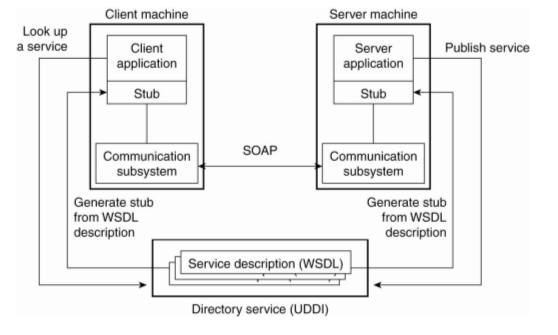

****************
SOAP Webservices
****************

Basiert auf den Grundsätzen von RPC.

Web Services, SOAP, WSDL; Apache Tomcat

Web Services Description Language (WSDL)
========================================
WSDL ist ein XML Format mit dem RPC beschrieben werden können.
Es handelt sich also eigentlich um eine IDL in XML.

WSDL schreibt man heutzutage nicht mehr von Hand, sondern wird mit Contract Generation
automatisch generiert (`wsimport` für Java oder `svcutil` für .NET).

Diese Tools können auch direkt Proxies, Skeletons und Stubs für ein Schema generieren.

Terminologie
------------

* Service
* Endpoint
* Binding
* Interface
* Operation
* Types

Serialization
-------------
Interoperabilität ist nicht gewährleistet. Ein .NET Client kann zum Beispiel keine
Java `HashMap` deserialisieren.

Es können verschiedene Implementation für die Serialiserung in Java benutzt werden:

* JAXB Implementation: In der JDK integriert
* 3rd Party Java-to-XML Mapper
    * Castor
    * OX

Kritik
------
* XML ist sehr verbose und deshalb nicht so gut lesbar
* WSDL ist eine komplexe Sprache mit einer hohen Lernkurve
* XML und XSD komplex

Tools können viele dieser Pain Points abnehmen.

SOAP Envelope
=============

Beispiel::

    <?xml version="1.0"?>
    <soap:Envelope xmlns:soap="http://www.w3.org/2001/12/soap-envelope"
     soap:encodingStyle="http://www.w3.org/2001/12/soap-encoding">
        <soap:Header>
            <m:Trans xmlns:m="http://www.w3schools.com/transaction/"
             soap:mustUnderstand="1">234</m:Trans>
        </soap:Header>
        <soap:Body>
            <m:GetPrice xmlns:m="http://www.w3schools.com/prices">
                <m:Item>Apples</m:Item>
            </m:GetPrice>
        </soap:Body>
    </soap:Envelope>

Apache Tomcat
=============

