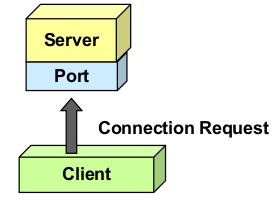
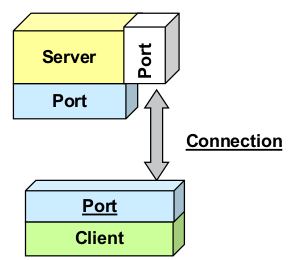
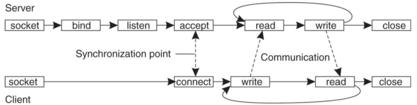

Sockets
=======

Socket Programmierung ist im Grunde Low-Level Messaging und ist der Basis Mechanismus
für verteilte Aufrufe.

Es wird kein Programmierkomfort geboten, es werden lediglich Byteströme auf
Programmierebene ausgetauscht.

Mechanismus
-----------
Ein Socket ist eine eindeutige Verbindung zwischen eine Client (IP + Port) und einem
Server (IP + Port).

.. CAUTION::

   Typische Fehler
   ^^^^^^^^^^^^^^^

   * Mit einem Port zu verbinden, für den kein BIND und LISTEN ausgeführt wurde 
   * BIND auf Port machen, der bereits belegt ist
   * Protocol Mismatches (Format stimmt nicht überein, Buffer überläuft)

Client
^^^^^^
Client kennt Hostname und Port für Connect mit Server:

1. stellt Connect her
2. erhält Socket Objekt
3. kommuniziert mit Methoden des Socket Objekts

Server
^^^^^^
Server kennt eigenen Port und ist im Listen Modus:

1. Listen: Wartet bis Client über den Connect Port verbindet
2. akzeptiert Request
3. erzeugt für jeden Request einen neuen Socket (neuer Port)
   um auf den Request zu antworten
4. Ursprünglicher Connect Sockets ist bereit für weitere Requests

Nachteile
---------
* Byteströme müssen erstellt und geparst werden
* Messaging Format muss selbst spezifiziert und implementiert werden
* Viele fehlende Features die heute Middleware übernimmt (z.B. Synchronization)

Berkeley Sockets
----------------
Funktioniert platformübergreifend für alle Sprachen gleich.

=========  ===============================================
Primitive  Meaning
=========  ===============================================
SOCKET     Create new communication end point
BIND       Attach a local address to a socket
LISTEN     Announce willingness to accept connections
ACCEPT     Block caller until connection request arrives
CONNECT    Actively attempt to establish connection
SEND       Send data over connection
RECEIVE    Receive data over connection
CLOSE      Release the connection
=========  ===============================================

Message Exchange Pattern (MEP) nicht garantiert
^^^^^^^^^^^^^^^^^^^^^^^^^^^^^^^^^^^^^^^^^^^^^^^
Weder die Socket API noch MPI legen das Message Exchange Pattern fest.
Dies muss in der Applikation festgelegt werden und muss behandeln können:

* Wer schreibt wann?
* Wie geht man mit Buffer Overflows um?
* Wie wird zwischen Client und Server synchronisiert?

Java Socket API
---------------

Die Klasse Socket in Java benutzt standardmässig einen TCP/IP Socket.

Server
^^^^^^
Beispiel für einen Single-Threaded Server, welcher die aktuelle Zeit liefert

.. code-block:: java 

    public class TimeServer {
        public static void main(String args[]) throws Exception {
            int port = 2342;
            ServerSocket server = new ServerSocket(port);
            while(true) {
                Socket client = server.accept();
                try(PrintWriter out = new PrintWriter(client.getOutputStream(), true)) {
                    Date date = new Date();
                    out.println(date);
                }
            }
        }
    }

Der Konstruktor des ServerSockets macht implizit einen BIND und LISTEN wenn ihm
ein Port übergeben wurde.
Mit dem `server.accept` Call warten wir bis ein Client eine Verbindung eröffnet,
um dann einen neuen Socket `client` zu eröffnen auf dem wir ihm daten zurücksenden
können.

Client
^^^^^^
Beispiel für den Client der die Zeit vom Server holt

.. code-block:: java 

    public class TimeClient {
        public static void main(String args[]) throws IOException {
            String host = "localhost";
            int port = 2342;

            Socket server = new Socket(host, port);
            try(BufferedReader in = new BufferedReader(new InputStreamReader(server.getInputStream))) {
                String date = in.readLine();
            }

    }

Der Client macht lediglich einen CONNECT und schreibt auf den Socket.

Berkeley Socket Pattern
^^^^^^^^^^^^^^^^^^^^^^^
Der Konstruktor in der Java Socket API macht vieles implizit (zum Beispiel den CONNECT
oder BIND). Es wäre besser die Berkely Sockets nicht zu abstrahieren sondern direkt
explizit `connect()` und `listen()` Methoden zu verwenden.

UDP und Multicast
^^^^^^^^^^^^^^^^^

* DatagramSocket für UDP
* MulticastSocket für Multicasts mit UDP

Multithreaded Server
--------------------
Fragen:

* Can one program listen to and accept connections on multiple ports?
* How can multiple clients connect to the same server without blocking the port?

TCP/IP vs UDP/IP
----------------

* Connection-Oriented vs Connection-Less
* QoS Unterschiede
    * Sequencing: Wird die Paketreihenfolge sichergestellt?
    * Packet loss: Werden Pakete erneut übertragen?
* Broadcast und Multicast möglich

.. NOTE:: Can one program listen to and accept connections on multiple ports?

.. NOTE:: How can multiple clients connect to the same server without blocking the port?

