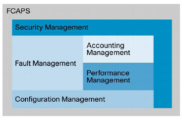
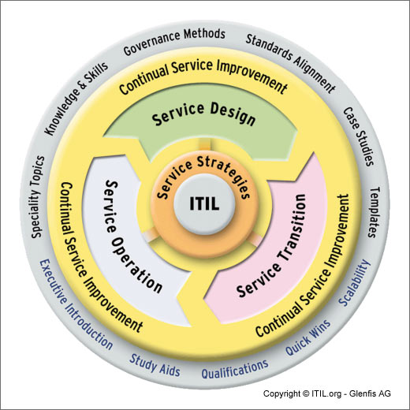
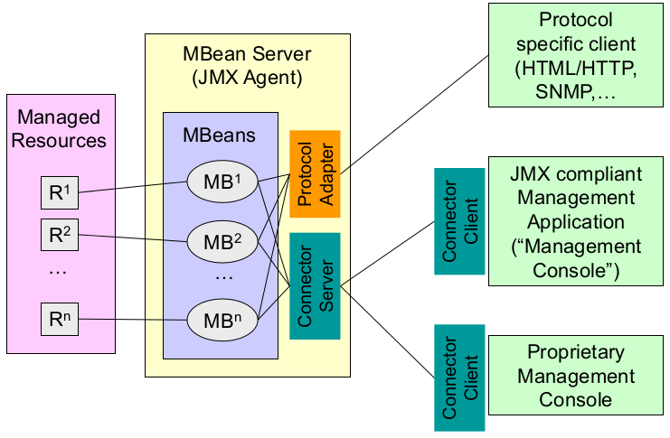

*****************
System Management
*****************

FCAPS
=====

Fault
    This involves the detection, isolation, and correction of a fault condition.
    Or in plain english, this lets you know when things are broken.
Configuration
    This involves the configuration of the software and hardware in the network.
    This includes the versions of software, the actual configurations, 
    change management, etc…
Accounting
    This involves the identification of cost to the service provider and
    payment due for the customer. Ie: Billing.
Performance
    This involves evaluating and reporting on the effectiveness of the network,
    and individual network devices.
Security
    Security is… well security. These are the network management activites that
    involve securing the network and the data running over it.

IT Infrastructure Library (ITIL)
================================
ITIL ist eine Sammlung von Best Practices

Systems Management Patterns
===========================

Wire Tap
--------

.. image:: images/wiretap.gif

Message History
---------------

.. image:: images/message-history.gif

Java Management Extensions (JMX)
================================

Logging
=======

Issues:

* The logging solution should be easy for a developer to use,
  reusable across different applications, and extensible to meet new needs.
* Logging should be centralized to a single point to allow an
  administrator to access it from one place.
* Logging should have little affect on application performance.
* The logging solution should filter messages, via configuration,
  by type to enable specific events to be triggered. These include things like
  persisting the message and performing alert notification,
  such as paging an administrator.
* The logging environment should allow for centralized
  and local logging by identifying different types.”

